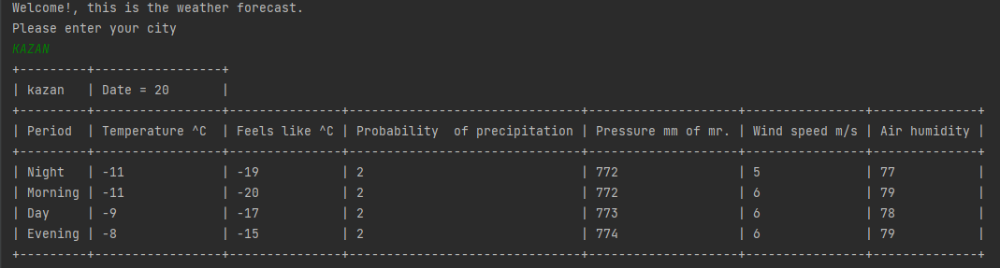

# Wearher_v1.0

## Реализация прогноза погоды на текйщий день

Ознакомиться с JAVA Collection 
Используя основные принципы ООП разработать приложение для прогноза погоды
Для парсинга HTML страницы использовал библиотека jsoup

## :sunny: Как работает:
Для того что бы узнать погоду на сегодня, введите название города, через _ если он состоит из 2 и более слов
